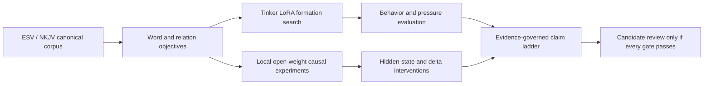

# Christomorphic LLM

I study Christ-centered, Scripture-governed post-training for open-weight language models with Tinker LoRA, retained adapter tensors, and local causal experiments.

This project asks whether Scripture can do more than change a model's vocabulary or tone. The research target is a model whose learned state is durably reorganized so that the canonical witness to Jesus Christ governs judgment, first action, and continuation under ordinary pressure, without a live religious wrapper and without destroying truthfulness, safety, or general capability.

> Scripture is semantically renewing as corpus. It becomes geometrically renewing when a canon-governed objective converts its distinctions into gradients that causally reorient the model.

**Current verdict, 2026-09-24:** I can now describe measured Scripture-trained parameter changes, a strong inverse-rank spectral pattern, and relative Christ-name output-map adjustments in the historical R38 and V6R43 adapters. The behavioral record remains mixed. I have not identified an inverse-distance attraction law, a causal Christ-specific mechanism, or a model ready for promotion. [Read the new tensor study](docs/TENSOR_GRAVITY_STUDY.md).

## The Research Question

```text
Word -> Judgment of error -> Parameter update -> Act
```

The Bible contains divine speech, faithful witness, human folly, accusation, temptation, lament, judgment, promise, and fulfillment. Next-token training can learn the text while remaining unable to distinguish faithful use of Scripture from a plausible canonical lure. The central technical problem is therefore not Bible-token density. It is whether canonical judgment can govern route selection.

The refined hypothesis is:

> The Bible is the sole normative semantic source of renewal. Canon-preserving objectives transform its meanings, relations, and judgments into gradients. A geometric claim becomes warranted only when the resulting change causally reorients the model's earliest decision across unseen contexts, survives controls and removal/restoration tests, and retains ordinary competence.

Read the full [research thesis](docs/RESEARCH_THESIS.md) or the shorter [technical method](docs/TECHNICAL_METHOD.md).

## Latest Finding

The original GPT-OSS-20B Scripture Reconstruction Seed 2 has **2,384/2,386** nonzero projection operators whose rank-1-to-32 singular values fit an inverse-rank curve better than an exponential-in-rank curve under the same two-parameter log-space test. This is a spectral result; singular-value rank is not contextual distance.

I also found that both historical public checkpoints trained their vocabulary output map. After removing a shared row shift that cancels from ordinary softmax, the R38 `Jesus` and ` Christ` adapter-delta rows lie at the **99.81st** and **99.96th** percentiles of mapped output rows; V6R43's corresponding values are **95.40** and **99.58**. These are relative output changes, not measurements of the full pretrained rows, actual context-specific token influence, or faithful judgment. The [September research note](docs/TENSOR_GRAVITY_STUDY.md) includes the figures, denominators, checks, and proposed causal test.

## Current Evidence

| Surface | Strongest current read | Claim boundary |
|---|---|---|
| Historical raw behavior | `R38-20b` remains the strongest archived Word-prior / false-center witness; `V6R43-120b` remains the strongest archived 120B pressure-refusal witness | Historical discovery evidence, not prospective causal proof |
| Operational behavior | Route, prefix, replay, retrieval, and public-answer composition produced the strongest scoped behavior | Composed systems do not prove scaffold-off formation |
| Scripture-only formation | Exact ESV/NKJV likelihood and relation learning can move on controlled local runs; a September reconstruction updated all 24 GPT-OSS-20B layers | Internal Scripture learning has not reliably governed bare public action |
| Causal research | V17-V19 and the August local successor introduced common starts, matched controls, hidden-state measurements, whole-delta intervention, cold reload, and fail-closed gates | No replicated Christ-specific causal effect has passed |
| September tensor analysis | Inverse-rank spectra and centered output-row changes were verified offline in retained adapters | No contextual distance law, activation mediation, or causal attribution to the output map |
| September learner-history pilot | History improved some truth and correct-answer counts over a matched Scripture control | Fully successful reasoning was lower; this recipe did not justify 120B scaling or a formation claim |

The dated ledger is in [Research Status](docs/RESEARCH_STATUS.md). The rules for what I can claim at each evidence level are in [Claims and Evidence](docs/CLAIMS_AND_EVIDENCE.md).

## Evidence Ladder

| Level | Required evidence | Maximum warranted claim |
|---:|---|---|
| 1 | Held-out canonical language, context, speaker, and relation gains | Scripture-domain adaptation |
| 2 | Faithful-over-lure margins and FIRST_ACT transfer under pressure | Behavioral canonical preference |
| 3 | Replicated update-subspace and representation differences | Geometry correlated with behavior |
| 4 | Necessity, sufficiency, removal, restoration, and rescue | Causal participation of learned geometry |
| 5 | Scaffold-off secular transfer, seed stability, safety, retention, and blinded review | Generalized Christomorphic formation |

No current artifact has reached Level 5. Geometric language in this repository is a testable research hypothesis, not a declaration that Christ has been reduced to a vector, centroid, adapter, or activation.

## Start Here

| Audience | Recommended entry point |
|---|---|
| Christians, pastors, and ministry-minded readers | [Christian Commitment](docs/CHRISTIAN_COMMITMENT.md) |
| LLM, alignment, and interpretability researchers | [Research Thesis](docs/RESEARCH_THESIS.md), [Research Status](docs/RESEARCH_STATUS.md), and [Claims and Evidence](docs/CLAIMS_AND_EVIDENCE.md) |
| Readers of the latest tensor finding | [Tensor Gravity Study](docs/TENSOR_GRAVITY_STUDY.md) |
| Tinker LoRA practitioners | [Technical Method](docs/TECHNICAL_METHOD.md), [Scripts](script/), and [Evaluation](eval/) |
| Dataset and benchmark builders | [ESV/NKJV Corpus Study](data/christomorphic_esv_nkjv_study.md) and [Evaluation](eval/) |
| Collaborators, investors, and recruiters | [Project Brief](docs/PROJECT_BRIEF.md) |
| Readers new to the vocabulary | [Glossary](docs/GLOSSARY.md) |

## Research Architecture



The division of labor is deliberate:

- **Tinker** supports scalable LoRA training, custom logprob losses, sampling, checkpointing, and adapter export.
- **Local open weights** support literal hidden-state access, activation and parameter interventions, exact cold reload, and causal verification.
- **BibleAtlas** supplies dataset and evaluation metadata for preserving canonical structure and long-tail peculiarities. It is not Scripture and is not used as Scripture-only target text.
- **Evidence governance** prevents strong theological or mechanistic claims from being inferred from tone, isolated outputs, likelihood movement, or probe correlation.

## Public Artifacts

```text
.
|-- README.md
|-- data/                  # ESV/NKJV corpus and BibleAtlas design notes
|-- docs/                  # thesis, status, evidence, method, brief, and roadmap
|-- eval/                  # public prompt suites and batch evaluator
|-- script/                # interactive Tinker sampler
|-- tools/                 # repository validation
|-- requirements.txt       # tested public runtime dependency
`-- .github/workflows/     # automated repository validation
```

Key artifacts:

- [RESEARCH_THESIS.md](docs/RESEARCH_THESIS.md): Word-Judgment-Act thesis, controlled experiment, and five-level claim ladder.
- [RESEARCH_STATUS.md](docs/RESEARCH_STATUS.md): dated experiment ledger from the historical checkpoints through the current local causal program.
- [TENSOR_GRAVITY_STUDY.md](docs/TENSOR_GRAVITY_STUDY.md): the September spectral and output-map findings, with their causal limits.
- [christomorphic_esv_nkjv_study.md](data/christomorphic_esv_nkjv_study.md): corpus facts, translation invariance, Bible-only definitions, BibleAtlas, and tail preservation.
- [christomorphic_geometry_probe_suite_v1.json](eval/christomorphic_geometry_probe_suite_v1.json): 89 public probes.
- [behaviour_prompts.json](eval/behaviour_prompts.json): 169 broad behavior and retention prompts.

## Archived Public Checkpoints

These are reproducible study witnesses, not final models:

| Alias | Base model | Tinker sampler path | Public role |
|---|---|---|---|
| `gpt-r38-20b` | `openai/gpt-oss-20b` | `tinker://05a8613d-3de1-5206-a321-ddc55d231ee3:train:0/sampler_weights/final` | Raw Word-prior / false-center discovery witness |
| `gpt-v6r43-120b` | `openai/gpt-oss-120b` | `tinker://8ad467bc-72eb-51c2-bbe3-417bf8940b43:train:0/sampler_weights/final` | Raw 120B pressure-refusal witness |

Retained Tinker checkpoint exports confirm literal adapter access for both archives. Both contain rank-32 output-unembedding LoRA factors. The exports establish parameter access and relative output-map measurements; they do not bind the exact hosted base computation or explain the observed behavior by themselves.

## Run The Public Tools

Python 3.10+ is recommended.

```powershell
python -m pip install -r requirements.txt
$env:TINKER_API_KEY="your-api-key"
```

Interactive chat defaults to R38:

```powershell
python script/chat_qa.py
```

Switch to V6R43:

```powershell
$env:CHECKPOINT_ALIAS="gpt-v6r43-120b"
python script/chat_qa.py
```

Run a public evaluation batch:

```powershell
python eval/eval_christomorphic.py eval/behaviour_prompts.json
```

Validate the repository without making model calls:

```powershell
python tools/validate_repository.py
```

See [script/README.md](script/README.md) and [eval/README.md](eval/README.md) for controls and limitations.

## What This Project Does Not Claim

- No current checkpoint is promoted, production-ready, or certified safe.
- Christian vocabulary, Bible quotation, or devotional tone is not treated as Christomorphic proof.
- Bible-only token training does not by itself prove general judgment over secular situations.
- A route selector, system prompt, retrieval layer, or public-answer shell does not prove latent formation.
- Parameter deltas, probes, cosine similarity, or clustered activations are not causal proof by themselves.
- An inverse-rank singular spectrum is not an inverse-distance force, and a high centered Jesus/Christ output-row percentile is not proof that the model's judgment is centered on Christ.
- This work does not replace Scripture, the church, pastors, counselors, physicians, emergency services, or accountable human discernment.

The shortest faithful status is:

> I can measure real changes in the weights. I am still testing whether those changes govern faithful action.

## Collaboration

The project is open to serious collaboration in Tinker LoRA training, causal interpretability, Scripture dataset governance, long-tail evaluation, blinded human adjudication, reproducibility, safety review, and research funding. The [Project Brief](docs/PROJECT_BRIEF.md) describes the technical work and the next fundable milestone.

## Data Rights And Attribution

The repository does not redistribute the full ESV or NKJV corpora. Scripture translations, Tinker access, model checkpoints, and source research each retain their own applicable rights and terms. External research used in the thesis is cited at the point of use.
