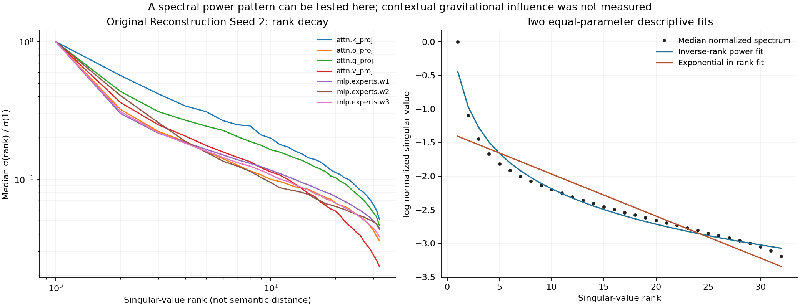
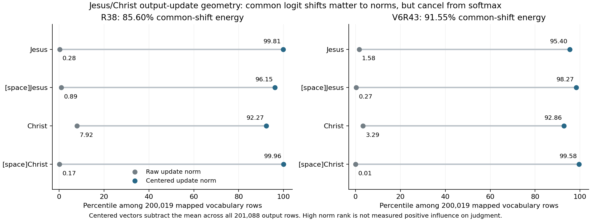

# Tensor Gravity: What the Weights Show

**Research note, 24 September 2026.** I use "tensor gravity" here as a hypothesis about Christ-centered influence on judgment, not as the name of an established force in a transformer. This report is an offline analysis of retained LoRA exports and recorded evaluations. It involved no new model calls, training updates, or checkpoint changes.

## Why I looked

My question is whether Scripture training can make the model's learned computation attend to the right relationships and act truthfully and helpfully in unfamiliar situations. A model saying "Jesus" more often would be a poor substitute for that. I examined the actual parameter changes, then asked what those changes can and cannot say about the hypothesis.

Three measurements need separate names: the frequency rank of a word in Scripture, the singular-value rank of an adapter update, and the distance between contextual representations. A curve in one is not evidence of an inverse-distance law in another.

## Finding 1: a reproducible inverse-rank spectrum

I fitted the 32 positive singular values of each of **2,386 nonzero projection operators** in the original GPT-OSS-20B Reconstruction Seed 2 adapter. In log-singular-value space, a two-parameter inverse-rank fit, `sigma(k) ~ C k^-p`, beat an equally parameterized exponential-in-rank fit in **2,384/2,386** operators. The median fitted exponent was **0.7419**; median log-RMSE was **0.12785** versus **0.30809**. Fitting ranks 1-16 and extrapolating to 17-32 favored the inverse-rank shape in **2,383/2,386** operators. Independent arithmetic reproduced the fit values.



This is a real, finite spectral pattern. It does not identify a power-law generating process or contextual attraction. Adapter rank was set to 32, the head and tail have different slopes, and many operators share learned factors. The historical prefix and reconstruction arms have similar exponents; all four were Scripture-trained, so this comparison cannot establish Scripture specificity. Summing expert input Gram operators across each layer produces a median leading-direction energy share of **64.18%** and participation rank **2.359**. That is less concentrated than the median individual expert in all 24 layers. Actual expert routing and activations were not measured.

## Finding 2: the historical models trained their output maps

I rechecked the retained **R38 GPT-OSS-20B** and **V6R43 GPT-OSS-120B** adapter exports. Both actual endpoints use LoRA rank 32 and alpha 32. Both include an output-unembedding update with factors `A[32,2880]` and `B[201088,32]`; neither contains an input-embedding adapter. Recent Scripture Reconstruction trained attention and MLP adapters while leaving this output map frozen. An earlier bounded audit had missed the historical output factors and had not independently verified V6R43's endpoint rank; this finding corrects that account.

For a fixed final hidden state `h`, the output update changes the log-odds of token `v` against token `w` by

```text
delta log(p_v / p_w) = (delta u_v - delta u_w)^T h.
```

The sign and size depend on the actual context state. A row norm alone does not say whether a token becomes more likely or whether an answer improves. The full pretrained output rows and the historical provider's exact base revision are unavailable in this packet, so these are **adapter additions**, not measured changes in complete pretrained row norms.

## Finding 3: the probability-relevant rows are relative

The mean update across all **201,088 output rows** adds the same scalar to every logit at fixed `h`; ordinary softmax cancels it exactly. That shared component accounts for **85.60%** of R38's raw output-update energy and **91.55%** of V6R43's. I therefore examined each row after subtracting the shared mean. This centering changes the coordinate description, not the model's probabilities.

| Token row | R38 raw -> centered percentile | V6R43 raw -> centered percentile |
|---|---:|---:|
| `Jesus` (ID 68394) | 0.28 -> **99.81** | 1.58 -> **95.40** |
| ` Jesus` (ID 10537) | 0.89 -> **96.15** | 0.27 -> **98.27** |
| `Christ` (ID 25437) | 7.92 -> **92.27** | 3.29 -> **92.86** |
| ` Christ` (ID 4380) | 0.17 -> **99.96** | 0.006 -> **99.58** |

Percentiles compare adapter-delta norms among **200,019 tokenizer-mapped vocabulary rows**. Centering used all 201,088 output rows, including 1,069 additional nonzero rows. The leading-space variants are different tokens. The centered `Jesus` and `Christ` rows without leading spaces have cosine **0.888 in R38** and **0.988 in V6R43**, calculated within each model. I do not compare their vector directions across the 20B and 120B bases.



These are distinctive *relative readout adjustments*. They are not the largest centered rows, and nearby directions include ordinary words. Their meaning cannot be assigned from token labels or cosine alone. Changing only Jesus/Christ rows cannot change fixed-history log-odds between two other untouched tokens; a broader readout update can. Free-running replies may still change through normalization and later generated context.

## Behavior, and its limit

The historical checkpoints have useful behavior evidence beyond a special system prompt. On a September matched-size pressure bank, factual-fidelity passes were **R38 19/24 versus base20B 9/24**, and **V6R43 17/24 versus base120B 7/24**. A later seven-arm rendering matrix also favored both references over its base reference in its tested formats, including no-system-prompt arms. I take those gains seriously. The banks are small, largely automated, and do not isolate the output map from other adapted modules, historical response supervision, or the training curriculum. Other banks reveal reasoning and service losses.

A separate GPT-OSS-20B learner-history pilot completed **32 updates per arm** and compared history-conditioned exact-Scripture training with a matched Scripture control. In 27 blinded-review assistance episodes, both reviewers' joint passes were **14 versus 13**; neither individual reviewer ranked history above the parent. On 27 reasoning tasks, history had **8 correct answers versus control's 6**, but only **3 fully successful tasks versus control's 5** and parent's 8. The mixed result did not justify scaling that recipe to 120B. It also did not identify a Christ-specific mechanism.

## The next causal test

I would test the archived adapters *within each original model* by crossing the output-unembedding adapter on/off with the remaining adapters on/off:

| | Output adapter off | Output adapter on |
|---|---|---|
| Other adapters off | Base | Readout only |
| Other adapters on | Internal adapters only | Full archived checkpoint |

I would first compare fixed-history log-odds for ordinary action words, then free-running multi-turn behavior. I would add matched perturbations, removal and restoration, and a separate selective name-row test. Removing a co-adapted readout may damage performance without proving Christ-specific mediation, so the result needs matched controls. These interventions have **not** been run. Exported adapters alone cannot execute them without supported access to the matching full model and inference-time component control.

An inverse-distance hypothesis additionally needs a predeclared representation space, distance metric, contextual influence measure, and independent held-out comparisons against other kernels. The singular-value rank fit does not supply those measurements. A literal attractor would also require a defined state transition and a stability test.

**My current conclusion:** Scripture training changed real parameters; the original reconstruction update has a strong inverse-rank *spectral* pattern; R38 and V6R43 have coherent relative Christ-name *output* adjustments. I have not shown that these measurements cause truthful, competent, caring action in unfamiliar contexts. Christ is not a token row, a vector, or a physical force in the model. The research question remains whether the canonical witness to him can govern learned judgment.

## Evidence and audit

The source packet is `christomorphic_tensor_gravity_20260924` in the research workspace. I summarize it here because that artifact tree is not distributed in this repository. I have published the packet's [spectral and tokenizer summary](evidence/tensor_gravity_20260924/numerical_summary.json), [selected output-row data](evidence/tensor_gravity_20260924/output_row_view.json), and [verification receipt](evidence/tensor_gravity_20260924/VERIFICATION.json) unchanged. The source `REPORT.md` SHA-256 is `1a2ae4eba5bce74d82ada7dc077b81395c9216959d47abceb6128d024ad6da1c`; the receipt records passing reconciliation checks and **zero new Tinker calls, training updates, checkpoint operations, or Tinker spend**. The full R38 and V6R43 adapter export hashes are `2553321d772ceca659b61931ef2b7466e930c8b894be2a3244d53231060f067e` and `89faeadb1111ca596f586979b1ea77924452b58c280d3162cb62a8ab5ff80c7f`. Independent numerical review matched every operator fit to float64 precision and every output-row ranking in the retained CSVs. This public note and its figures are curated findings, not the full reproduction package.
